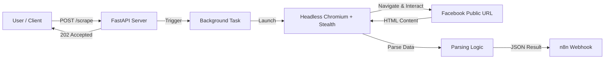

# Project Overview: Minimal Facebook Scraper

## 🎯 Goal

To provide a **stealthy, reliable, and testable** solution for scraping public Facebook Reels and posts without authentication. The system is designed for 2026-era anti-bot defenses, prioritizing low detection over high volume initially.

## 🏗️ Architecture

The project is built as a microservice using:

- **FastAPI:** Handles HTTP requests and background task management.
- **Playwright (Async):** Controls a headless Chromium browser for rendering and interaction.
- **Playwright Stealth:** A plugin to mask standard automation signals (webdriver flags, etc.).
- **Docker:** Encapsulates the environment (browser binaries, dependencies) for consistent execution.

### Data Flow

## 🧠 Key Design Decisions

### 1. No Authentication (Guest Mode)

- **Why?** Logging in with bots is the fastest way to get accounts banned.
- **Trade-off:** We can only access _public_ data. We cannot see comments deep in threads or private groups.
- **Resilience:** If a scraping node is IP-banned, we just rotate the IP (proxy), not a precious Facebook account.

### 2. Stealth Over Speed

- **Why?** Facebook's anti-bot systems (likely AI-driven in 2026) detect non-human behavior instantly.
- **Implementation:**
  - **Random Delays:** The scraper waits 10-30 seconds randomly.
  - **Human Emulation:** Mouse movements and random scrolling are simulated.
  - **Browser Fingerprinting:** Configured to look like a real user (User-Agent, Viewport).

### 3. Async Background Processing

- **Why?** Browser automation is slow (30s+ per page). Blocking the HTTP request would cause timeouts.
- **Mechanism:** We return `202 Accepted` immediately and process the heavy lifting in the background, pushing the result to a webhook when done.

## 🛡️ Current Constraints

- **Volume:** Safe for ~10 requests/day per IP. Higher volume requires proxies.
- **Speed:** Slow by design aiming for undectability.
- **Scope:** Only public Reels/Posts. No profiles, no groups (unless public).

## 🚀 Future Proofing

This architecture is modular. The "Browser" component can be swapped for a remote browser cluster or a scraping API service without changing the core FastAPI logic.
